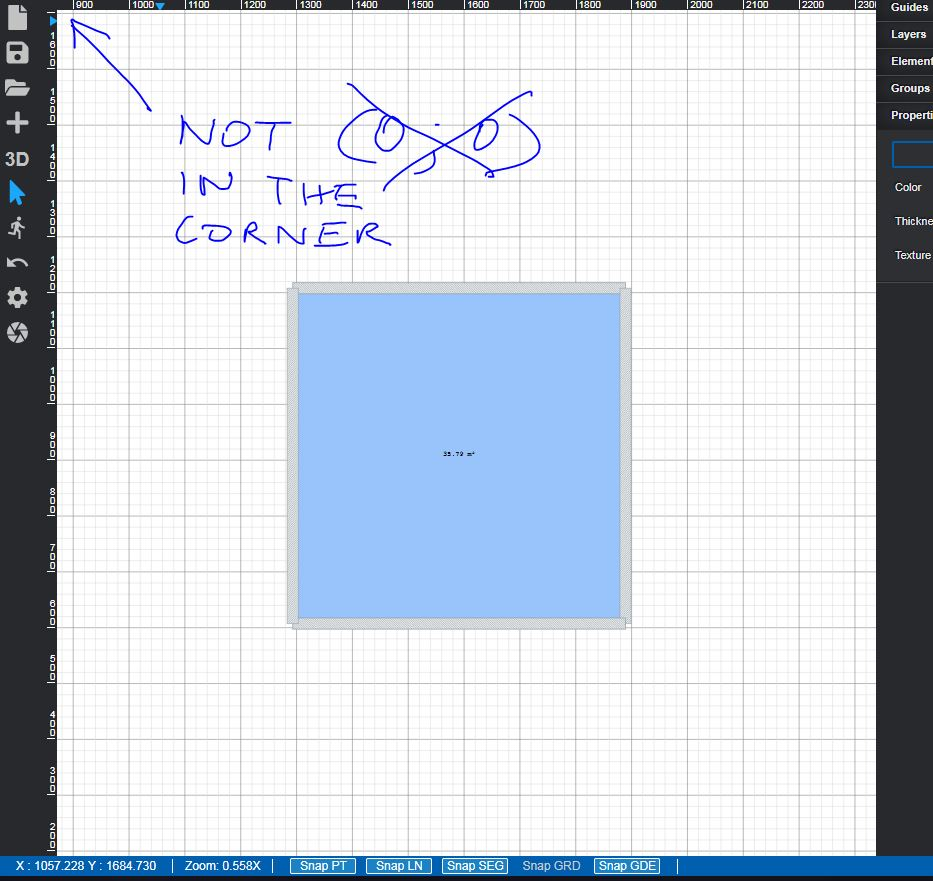

# Task_22-shiftdocument

1. shift initial pan parameter to provide bigger work area for the user. 
2. Use built in parameters of react-svg-pan-zoom module
3. Initial position of the canvas should be center of the document

estimated time: 3h

